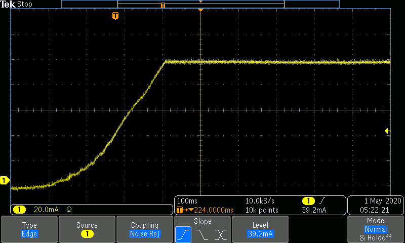

# Examples for Operating a SpikeSafe in DC modes

## Purpose
- These sequences contain code to run a SpikeSafe in either DC or DC Dynamic mode
- These operation modes output constant current at the specified Set Current. Current is outputted with a software current ramp and automated power reduction
- In DC Dynamic mode, the Set Current can be modified while the SpikeSafe is outputting current

## Key Settings
- **Set Current:** 100mA
- **Compliance Voltage:** 10V
- **Ramp Rate:** Default. Voltage will ramp as fast as 10V/sec. Current will ramp as fast as 1A/sec.

## Images
- When running either sequence, one can expect to see the following current ramp. This image was acquired by measuring output current using a TCPA300 Current Probe into a MDO3024 Mixed Domain Oscilloscope

