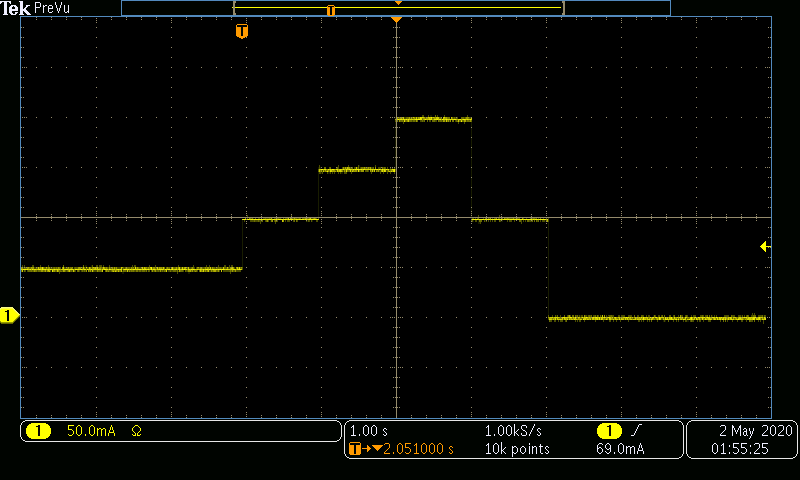

# Examples for Operating a SpikeSafe PRF or SMU in DC modes

## Purpose
How to use a SpikeSafe PRF or SMU to deliver high precision DC current to an LED or Laser.  These operation modes output constant current at the specified Set Current. Current is outputted with configurable current ramp and automated power reduction to protect devices under test.

DC mode and DC Dynamic mode operate very similarly. Generally, Vektrex recommends running with the newer DC Dynamic mode in order to take advantage of dynamic current changes during operation, as well as more efficient internal calculations within the SpikeSafe.  DC mode is recommended for maximum efficency such as long term reliability testing.

## Overview Run Dc Mode
Operates SpikeSafe as DC current source with single output current.

## Key Settings RunDcMode 
- **Set Current:** 100mA
- **Compliance Voltage:** 10V
- **Ramp Rate:** Default. Voltage will ramp as fast as 10V/sec. Current will ramp as fast as 1A/sec.

## Current Output Run Dc Mode 
- When running either sequence, one can expect to see the following current ramp. This image was acquired by measuring output current using a TCPA300 Current Probe into a MDO3024 Mixed Domain Oscilloscope

## Overview Run Dc Dynamic Mode 
Operates SpikeSafe as DC current source with multiple output current. In DC Dynamic mode, the Set Current can be modified while the SpikeSafe is outputting current.  This example can be used to generate a software controlled stair case ramp. 

## Key Settings Run Dc Dynamic Mode
- **Set Current:** 50mA initially. While the channel is operating, the Set Current will be dynamically changed to 100mA, 150mA, 200mA, then back to 100mA.
- **Compliance Voltage:** 10V
- **Ramp Rate:** Default. Voltage will ramp as fast as 10V/sec. Current will ramp as fast as 1A/sec.

## Current Output Run Dc Dynamic Mode
- In addition to seeing the current ramp in the figure above, one can expect to see the following current modifications when running this DC Dynamic sequence. This image was acquired by measuring output current using a TCPA300 Current Probe into a MDO3024 Mixed Domain Oscilloscope

