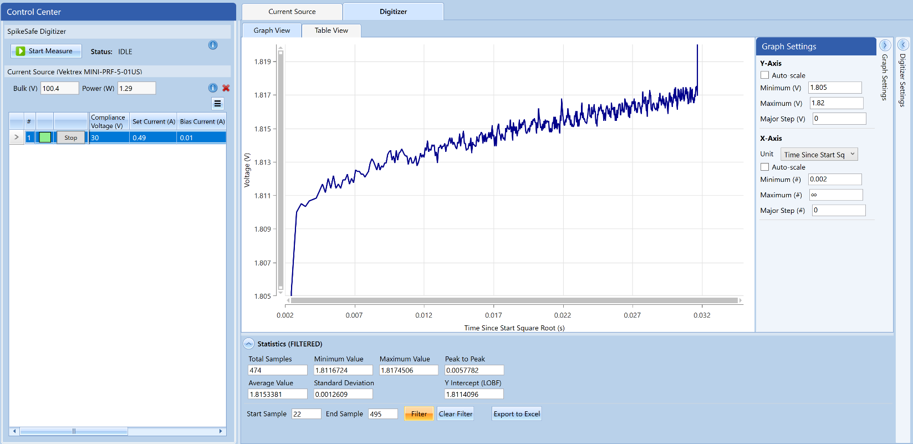

# Example for Controlling Thermal Platform Temperature using a Thermal Controller

## **Purpose**
In this sequence, we will address how to control a thermal platform's temperature using a thermal controller in an integrated system. A thermal controlled platform is often used in LED/laser systems to control DUT temperature for taking precise junction temperature (Tj) measurements, and stabilizing temperature-controlled environments.

## Overview 
Operates a thermal controller (Arroyo 5400 Series TECSource) to control a thermal platform (Arroyo TEC 284 Series High Power LaserMount). The controller will have the platform to ramp up to 50°C, stabilize, and run for 10 minutes; then ramp down to 25°C, stabilize, and run for 10 minutes. 

Install the libraries listed in the [Considerations](#considerations) section of this document. More information on TECSources can be found [here](https://www.arroyoinstruments.com/categories/temperature-controllers) and LaserMounts [here](https://www.arroyoinstruments.com/categories/lasermounts).

## Key Settings 
The following settings are configured by default. At the top of the sequence, there are multiple lines corresponding to individual test parameters. These lines may be modified to match the necessary parameters for your specific LED or Laser.

### Thermal Controller Settings
- **Set Temperature One:** 50°C
- **Set Temperature One Stability Time:** 10 minutes
- **Set Temperature Two:** 25°C
- **Set Temperature Two Stability Time:** 10 minutes

## Considerations
- This sequence involves connecting to a serial thermal controller using RS-232 interface and requires the [pyserial](https://pypi.org/project/pyserial/) library. See instructions on installing this library under the "Usage" section in the [SpikeSafePythonSamples markdown file](/README.md#installing-pyserial-package).

## Expected Results
After initializing the thermal controller, the thermal controller will ramp up to Set Temperature One at 50°C and stabilize for 10 minutes. Afterwards the thermal controller will ramp down to Set Temperature Two at 25°C and stabilize for 10 minutes.

## Useful Products for Controlling Thermal Platform Temperature using a Thermal Controller

Vektrex [Control Panel Software Application](https://www.vektrex.com/software-applications/control-panel/) provides a user interface to easily perform Tj measurements in minutes. Control Panel provides control over SpikeSafe current output, Voltage Digitizer measurements, and graphing tools such as a time square-root graphing and line-of-best-fit y-axis extrapolation in order to programmatically determine Vf(0). See the figure below:

For more information regarding Vektrex Control Panel, contact sales@vektrex.com.