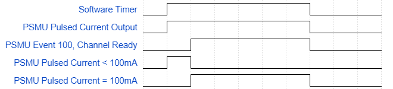

# Example for Making Fixed Pulsed Count Using Software Based Timing

## Purpose
Demonstrate how to use a SpikeSafe DCP, PRF, or PSMU to make fixed pulse count using software-based timing.

## Overview
Making fixed pulsed count using software-based timing is simple when a rough number of fixed pulses is required. Continuous and Continuous Dynamic operation modes output a continuous current pulse train at the specified Set Current, On Time, and Off Time. Combined with using a software-based timer, a fixed count of continuous current pulses can be made to a device in a simple setup.

## Key Settings

### SpikeSafe Current Output Settings
- **Pulse Mode:** Continuous Dynamic
- **Current:** 100mA
- **Set Current:** 3.5A (may modify according to DUT characteristics)
- **Compliance Voltage:** 10V
- **On Time:** 1us
- **Off Time:** 9us

### Software Settings
- **Pulse Count:** 10,000
- **Time Waited to Achieve Pulse Count:** 30ms

## Considerations
- See [Run Pulsed](../../run_spikesafe_operating_modes/run_pulsed) for further descriptions of when to Continuous and Continuous Dynamic operation modes.
- SpikeSafe current pulse train starts when the SpikeSafe channel is turned on. To ensure expected current pulsing is supplied, the time to achieve pulse count is started after `Event 100, Channel Ready`, there's an expectation to in excess over the expected number of pulses.
- `Event 100, Channel Ready` signals current pulses are outputting at the desired set current amperage. In this example prior to this event, the SpikeSafe current pulse train begins to ramp up from 0A to 100mA, once current stabilizes at 100mA the channel ready event is signaled. See the following timing diagram showing how the software timer, pulsed current output, and channel ready event are related:

- Due to software-based timing there will be a difference between the number of actual pulses and the expected number of pulses.

## Expected Results
Taking [Considerations](#considerations) into account, there's an expectation to see over 10,000 pulses.

A frequency counter to track the number of pulses showed an output of 12,810 pulses. This indicates ~2,810 pulses were outputted before the SpikeSafe provided pulses at a full current of 100mA, and ~10,000 pulses during the time waited to achieve the desired pulse count.

