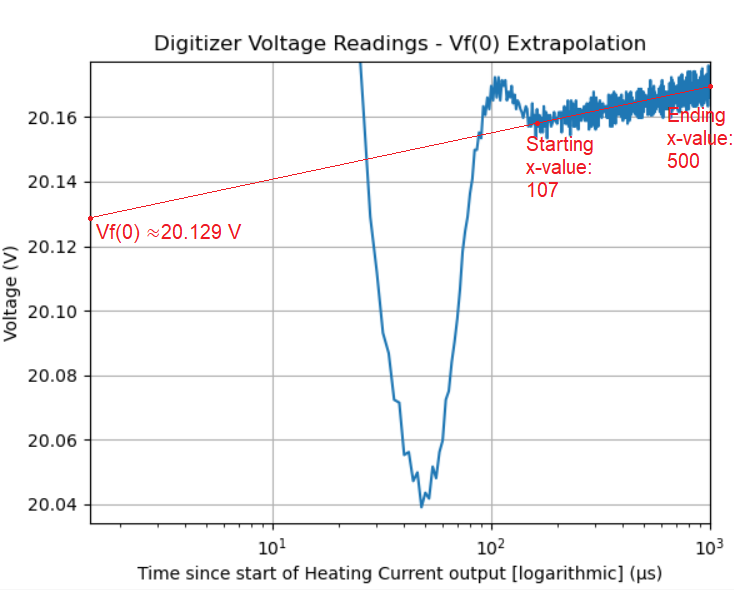

# Example for Measuring In-Situ LED Junction Temperature using the SpikeSafe SMU

## Purpose
Demonstrate how to make in-situ junction temperature (Tj) measurements on an LED or luminaire using the SpikeSafe SMU and its integrated Voltage Digitizer.

## Overview 
The junction temperature (Tj) of an LED is the temperature in the LED's active region, which is the point at which the diode connects to its base. Tj is a vital measurement in determining the efficiency of a part to remove heat, and therefore the expected lifetime of the part. A majority of the technology in the market limits the user to making Tj measurements after removing the part from its typical housing, which is both time-consuming and does not provide an accurate comparison to the part's typical operating Tj. The SpikeSafe SMU's Continuous Dynamic Bias Current (CDBC) mode along with its integrated Voltage Digitizer make it possible for users to measure an LED's Tj in its typical housing (i.e. "in-situ").

This test procedure follows the Electrical Test Method specified by the Joint Electron Device Engineering Council. More information can be found at [JESD 51-51](https://www.jedec.org/sites/default/files/docs/JESD51-51.pdf), [LEDs Magazine](https://www.ledsmagazine.com/manufacturing-services-testing/article/14173251/jedec-technique-simplifies-led-junction-temperature-measurement), and [the Vektrex website](https://www.vektrex.com/news-articles/category/applications/junction-temperature-tj/).

## Procedure
In this sequence, three major steps will be performed in order to determine the in-situ Tj of an LED:

1. Determine the K-factor - the change in forward voltage corresponding to a change in temperature for the LED
2. Run in CDBC mode at the using the typical operating current (i.e. the Heating Current) to heat the LED until its temperature stabilizes
3. While still running in CDBC mode, measure to determine the forward voltage at the point when the current transitions from the Heating Current to the Measurement Current

The values obtained in each step can then be used in the following equation to calculate the LED junction temperature:

When running this sequence, the test circuit should match the figure below:

The three steps outlined above are described in more detail below:

**1 - Determine the K-factor**

The K-factor is calculated by first controlling the LED temperature using a temperature-controlled platform. This temperature should be the intended heat sink temperature during operation; for many cases, this is room temperature or 25°C. Then, a constant bias current should be outputted to the DUT at either 3% of its operating current, or 33mA (whichever is lower). For the rest of the test, this current will be referred to as the Measurement Current. Measure the forward voltage and the LED temperature in this state. This voltage and temperature are considered V1 and T1, respectively.

While still outputting the Measurement Current, set the temperature-controlled platform to a higher temperature similar to the estimated junction temperature. Once both the forward voltage and platform temperature have stabilized, once again document these values. These values will be considered V2 and T2, respectively.

The K-factor is then calculated using the following equation:

The K-factor should have the unit V/°C.

**2 - Run in CDBC until LED temperature has stabilized**

Once the K-factor has been determined, temperature control should remain at T1. The SpikeSafe should then be operated in CDBC mode with the settings defined in the **Key Settings** section. When operating in this mode, the set current is called the Heating Current. The DUT should be powered using these conditions until the LED temperature has stabilized. This may take multiple minutes.

**3 - Measure Forward Voltage and extrapolate to obtain Vf(0) to calculate Tj**

Once the temperature has stabilized, initialize the Digitizer. A series of voltage measurements will be taken as soon as the current transitions from the Heating Current to the Measurement Current. This concept is illustrated in the figure below:

By graphing the voltage across the cooling period using a time-square-root axis, the rise in voltage due to cooling should appear linear.  Then Vf(0) should be extrapolated, similar to the diagram below:

Once Vf(0) is obtained, we have all of the values necessary to calculate Tj. Junction temperature is then calculated using the following equation:

## Key Settings

### SpikeSafe Current Output Settings
- **Pulse Mode:** Bias Current, then Continuous Dynamic Bias Current
- **Bias Current (Measurement Current):** 33mA
- **Set Current (Heating Current):** 3.5A
- **Compliance Voltage:** 40V
- **On Time:** 1s
- **Off Time:** 1ms
- **Ramp Rate:** Fast. Voltage will ramp as fast as 1000V/sec. Current will ramp as fast as 50A/sec.

### Digitizer Voltage Measurement Settings
- **Voltage Range:** 100V
- **Aperture:** 2µs (min)
- **Trigger Delay:** 0µs
- **Trigger Source:** Hardware
- **Trigger Edge:** Falling
- **Trigger Count:** 1
- **Reading Count:** 500

## Considerations

### Sequence
- This sequence assumes the user has basic knowledge of SpikeSafe Bias Current and CDBC Modes. To find more information on the basics of SpikeSafe operating modes, see [Run SpikeSafe Operating Modes](../../run_spikesafe_operating_modes).
- This sequence provides the layout to run Tj measurement for a specific DUT. For your testing, you may have to modify the Set Current, Bias Current, and Compliance Voltage to obtain an accurate Tj measurement. For this test, a Bridgelux LED with the following characteristics was used:
    - Forward current: 3.5A
    - Forward voltage: ~23V
- At the start of this sequence, there is a line `graph_zoom_offset = 0.01`. If this test is run and the outputted graph in step 3 has a zoomed y-axis such that Vf(0) cannot be clearly determined, modify this number. A larger graph zoom offset will correspond to a more zoomed out y-axis, and a smaller graph zoom offset (minimum = 0) will correspond to a more zoomed in y-axis.

### Best Practices
- If possible, use aged or burned-in LEDs for measurement
- T1 should be at the desired heat sink temperature (e.g. 25°C)
- T2 should be close to the estimated junction temperature
- Generally, it is recommended to keep the Compliance Voltage about 20V greater than the forward voltage for this test
- Measurement current should be the maximum of 3% of the heating current and the maximum allowable bias current (33mA)
- For best results, it is recommended to perform [Pulse Tuning](../pulse_tuning) prior to performing this test. It is better to have a fast rise time with some overshoot than a slower rise time.

## Expected Results
Message boxes will appear at various portions of the test to wait for user input. Perform the specified test operations when these message boxes appear, and then press "OK" to continue with the test procedure. Once step three is reached, a graph will appear similar to below:

From this graph, the user will have to estimate the Vf(0) value by extrapolating the straight line towards the y-axis. After determining the Vf(0) value, the junction temperature can then be calculated using the following equation:

## Useful Products for Tj Measurement

Vektrex [Control Panel Software Application](https://www.vektrex.com/software-applications/control-panel/) provides a user interface to easily perform Tj measurements in minutes. Control Panel provides control over SpikeSafe current output, Voltage Digitizer measurements, and graphing tools such as a time square-root graphing and line-of-best-fit y-axis extrapolation in order to programmatically determine Vf(0). See the figure below:

For more information regarding Vektrex Control Panel, contact sales@vektrex.com.