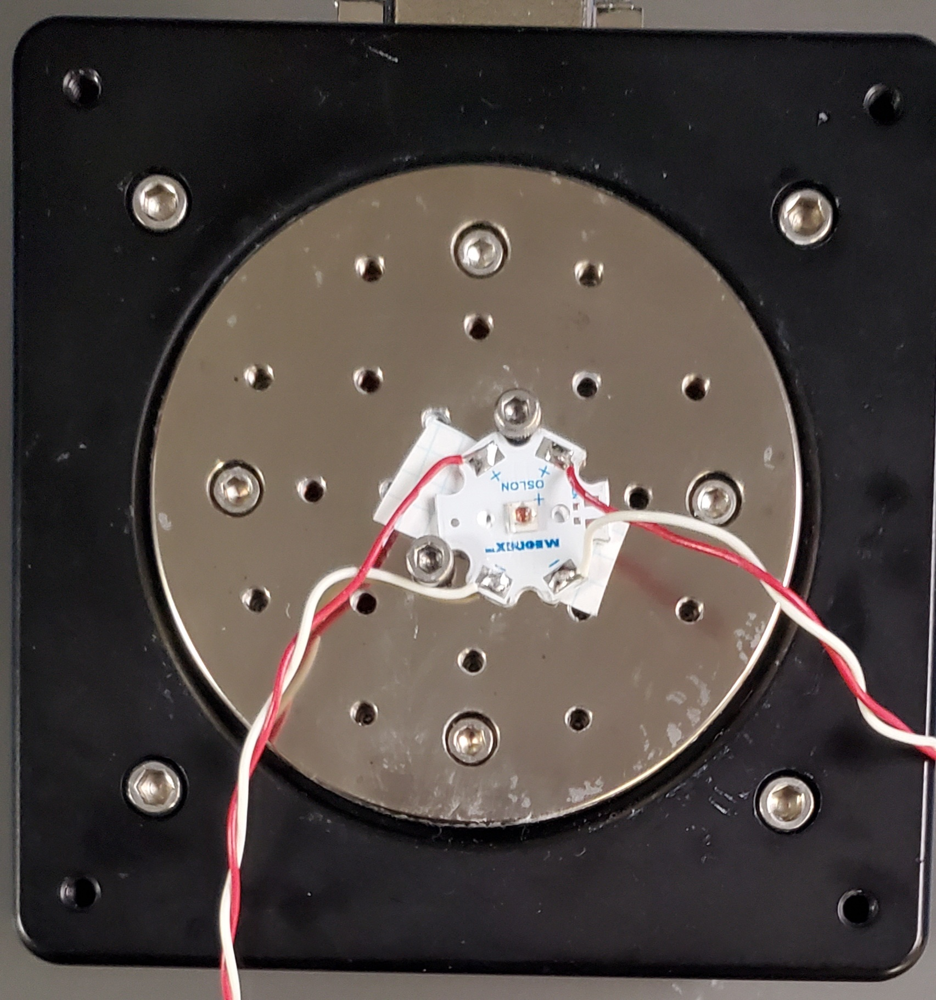
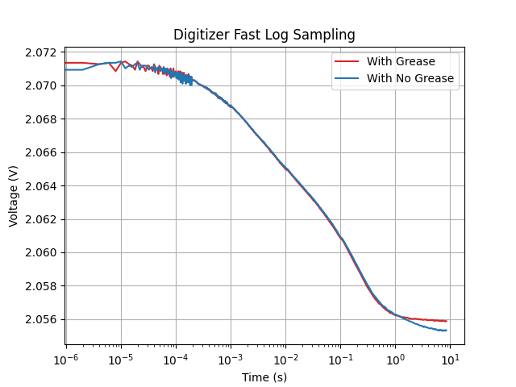
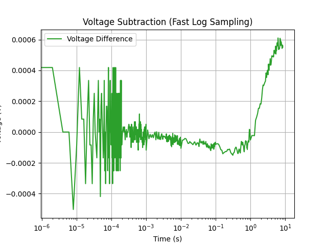
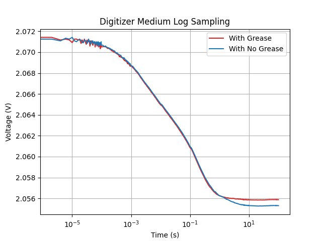
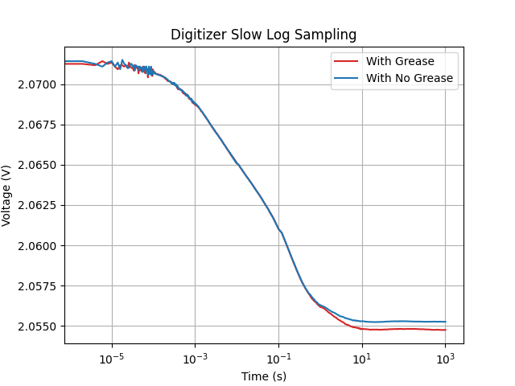
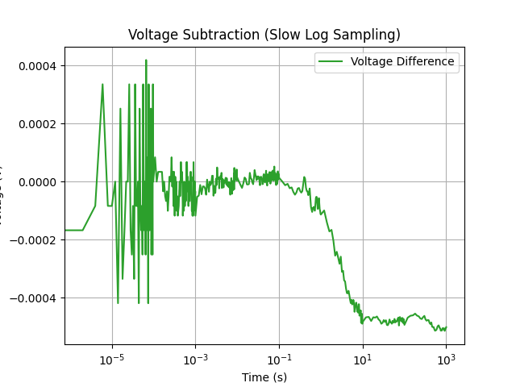

# Making Transient Dual Interface Measurement (JESD51-14) with PSMU

## Purpose
Demonstrate how to make a challenging Transient Dual Interface Measurement (TDIM) (JESD51-14) with the Vektrex PSMU. The TDIM measurement uses a DUT's forward voltage to deterimine junction temperature. A power step is applied to the DUT and forward voltage data is collected over an extended time period of many seconds. The changes in the forward voltage can then be analyzed to determine the thermal resistance of the DUT.

## Overview
Test method Transient Dual Interface Measurement (JESD51-14) determines the conductive thermal resistance of a device with heat flow. Both designing a device and optimizing its thermal resistance can be a challenging process that may be time consuming and tedious to reproduce. Using the Vektrex PSMU along with a simple stable thermal platform provides a trustworthy reproducible solution in an optimized amount of time.

Vektrex PSMU's Digitizer measures voltage using optimized sampling algorithms for simple thermal modeling. There are three sampling algorithms the Digitizer provides:
1. Fast Sampling
2. Medium Sampling
3. Slow Sampling

Running the test method requires only running one of the sampling algorithms at a time. The following sub-sections discuss which sampling algorithm to select.

### Fast Sampling
Vektrex PSMU's Digitizer Fast Sampling algorithm provides sample data from 2 microseconds to 8.5 seconds. It is appropriate for DUTs that are in either a smaller package or contain a smaller thermal mass. 525 individual voltage DUT measurements divided into the following samples at each aperture:
| Sample Number | Sample Count | Aperture |
| - | - | - |
| 1-100 | 100 | 2 us | 
| 101-180 | 80 | 10 us | 
| 181-270 | 90 | 100 us | 
| 271-360 | 90 | 1 ms | 
| 361-450 | 90 | 10 ms | 
| 451-525 | 75 | 100 ms | 

### Medium Sampling
Vektrex PSMU's Digitizer Medium Sampling algorithm provides sample data to 2 microseconds to 100 seconds. 500 individual voltage DUT measurements divided into the following samples at each aperture:
| Sample Number | Sample Count | Aperture |
| - | - | - |
| 1-50 | 50 | 2 us | 
| 51-125 | 75 | 12 us | 
| 126-200 | 75 | 120 us | 
| 201-275 | 75 | 1.2 ms | 
| 276-350 | 75 | 12 ms | 
| 351-425 | 75 | 120 ms | 
| 426-500 | 75 | 1.2 s |

### Slow Sampling
Vektrex PSMU's Digitizer Slow Sampling algorithm provides sample data from 2 microseconds to 1000 seconds. It is recommended for DUTs with a larger package or a larger thermal mass. 500 individual voltage DUT measurements divided into the following samples at each aperture:
| Sample Number | Sample Count | Aperture |
| - | - | - |
| 1-50 | 50 | 2 us | 
| 51-140 | 90 | 10 us | 
| 141-230 | 90 | 100 us | 
| 231-320 |  90 | 1 ms | 
| 321-365 | 45 | 20 ms |
| 366-410 | 45 | 200 ms | 
| 411-455 | 45 | 2 s |
| 456-500 | 45 | 20 s |

More information about the TDIM can be found at [JESD 51-14](https://www.jedec.org/standards-documents/docs/jesd51-14-0)

## Procedure
In this sequence, four major steps will be performed to determine the conductive thermal resistance of an LED.
1. Record expected environment voltage data - over time in a thermal controlled setting, with no thermal grease under the LED.
2. Wait 5 minutes to let LED cool down for next test. LED must be sufficiently cool and returned to its thermal state prior to running the previous test, otherwise the next test's voltage readings may not be accurate due to heat bias.
3. Record maximally cooled environment voltage - over time in a thermal controlled setting, with thermal grease under LED for heat to maximally dissipate from the LED to the thermal platform.
4. Produce conductive thermal resistance over time - calculate the voltage differences between expected environment voltage and maximally cooled environment voltage data to plot the conductive thermal resistance over time.

**1. Record expected environment voltage data**

Setup the PSMU connections, thermal platform controller connections, LED with no grease, and thermal platform controller to desired temperature:

Run digitizer_log_sampling_demo.py script, select slow, medium, or fast, and no grease when prompted.

**2. Wait 5 minutes to led LED cool down for next test.**

**3. Record maximally cooled environment voltage**

Setup LED with grease:

Run digitizer_log_sampling_demo.py script, select slow, medium, or fast (same option as Step 1), and grease when prompted.

**4. Produce conductive thermal resistance over time** 

Run produce_conductive_thermal_resistance.py script.

**NOTE**
Messages will appear in the console at various portions of the test and will prompt user input. Perform the specified test operations when these messages appear, and then press "Enter" to continue with the test procedure.

## Key Settings
### SpikeSafe Current Output Settings
- **Pulse Mode:** DC Dynamic
- **Set Current:** 0.35A (may modify according to DUT characteristics)
- **Compliance Voltage:** 25V (may modify according to DUT characteristics)
- **Ramp Rate:** Fast. Voltage will ramp as fast as 1000V/sec. Current will ramp as fast as 50A/sec.

### Digitizer Voltage Measurement Settings
- **Voltage Range:** 10V (may modify according to DUT characteristics)
- **Sampling Mode:** FAST LOG (may modify according to DUT characteristics)
- **Trigger Delay:** 50µs
- **Trigger Source:** Hardware
- **Trigger Edge:** Rising

### Thermal Controller Platform Settings
- **Set Temperature:** 25°C

## Considerations
### Sequence
- Procedure step additional details:
  - Steps 1 and 3 voltage are interchangeable, and can be individually re-ran if need be.
  - Steps 1 and 3 must use the same Digitizer Voltage Sampling Mode, otherwise an error will occur in Step 4.
    - FASTLOG will take 10 seconds to complete, MEDIUMLOG takes 100 seconds, and SLOWLOG will take 1000 seconds to complete. Abort the Step if it takes longer to complete than the aforementioned times.
  - Recorded voltage measurements saved to data log files in Steps 1 and 3 will be overwritten when re-running that Step.
- For your testing, you may have to modify settings as pointed out under Key Settings to obtain accurate voltage measurements. For this test, an Osram LED with the following characteristics was used:
  - Forward current: 0.35A
  - Forward voltage: ~2.6V
  - Set Temperature: 25°C
  - Time to reach thermal equilibrium: <10 seconds
- For your testing, you may need to select an appropriate thermal controller platform with enough cooling capacity for your device. For this test an Arroyo 5400 Series TECSource was used.
- This sequence assumes the user has basic knowledge of SpikeSafe DC Dynamic mode. To find more information on the basics of SpikeSafe operating modes, see Run SpikeSafe Operating Modes.

### Best Practices
- Generally, it is recommended to keep the Compliance Voltage about 20V greater than the forward voltage for this test

## Expected Results

### Fast Log Results
Voltage measurements taken with no grease and with grease are similar until roughly ~1s when the voltages start to diverge. From ~1.5s and above the no grease voltage measurements begin to  decline more quickly due to an increase in the LED junction temperature, this conveys the LED's heat is not dissipating fast enough through the thermal platform.

### Medium Log Results
The Medium Log has the similar results as the Fast Log that the two voltages curves start to diverge at roughly ~1s. The voltage measurement taken with no grease shows that the LED tends to reach the temperautre steady state from ~10s. A slower log sampling can be applied for clearly showing voltages stablization. See the Slow Log Results in the next sub-section.

### Slow Log Results
Fast Log and Medium Log Results shows that the LED reaching temperature steady state should be reflected with a stable voltage reading over time. Here if the voltage readings have not stabilized yet, this test will be repeated using Slow Log. Slow Log shows the same result, from ~1.5s and above, of an decline more quickly in no grease voltage measurements due to an increase in LED junction temperature. Additionally, starting at ~10s and above shows the LED reaches temperature steady state with no grease, whereas at ~700ms and above the LED reaches temperature steady state with grease.

Using this information can help determine the optimal parameters and environments which are suitable for this LED's behavior. Thanks to Vektrex's PSMU and a stable thermal platform, JESD51-14 testing can be repeated easily and reliably to provide key performance metrics of any DUT.

## Useful Products for Making Transient Dual Interface Measurement (JESD51-14)

Vektrex [Control Panel Software Application](https://www.vektrex.com/software-applications/control-panel/) provides a user interface to easily perform TDIM measurements in minutes. Control Panel provides control over SpikeSafe current output, Voltage Digitizer measurements, and graphing tools such as a time logarithmic graphing to obtain grease and no grease measurements to calculate TDIM. See the figure below:

For more information regarding Vektrex Control Panel, contact sales@vektrex.com.