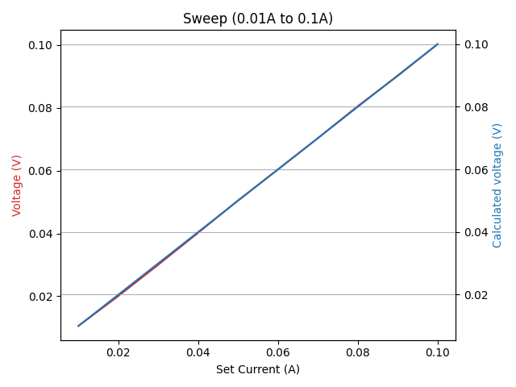
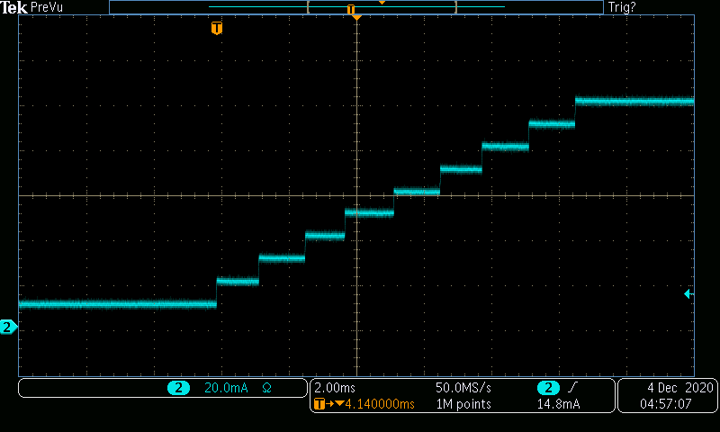

# Examples for Measuring DC Staircase Voltages Using the SpikeSafe PSMU Digitizer in DC Dynamic Mode

## Purpose
Measuring DC staircase voltages is essential in comparing the actual versus expected I/V results of a DUT. This example demonstrates how to use a SpikeSafe PSMU to provide a DUT DC current in a staircase pattern and take a voltage measurement at each step. This is an alternative to [Measure Pulsed Sweep Voltage](../../making_integrated_voltage_measurements/measure_pulsed_sweep_voltage) when presented with any of the following cases:
1. No hardware triggering is available on external device
1. Trigger timing is greater than 5ms

The SpikeSafe PSMU's integrated Digitizer is used to make high precision voltage measurements while outputting a DC current steps to the DUT. The Digitizer is taking triggered readings using a software trigger initiated by a SCPI command. In this case a 1 ohm resistor is used as the DUT.

## Overview 
Operates SpikeSafe as both DC current source and a high precision voltage measurement device. A DC output is demonstrated in [Run DC Mode](../../run_spikesafe_operating_modes/run_dc). While current is outputted, voltage measurements are being taken across the flattest portion of each current pulse. After all measurements are taken and read, the results are plotted in an I-V graph.

The SpikeSafe is set to simultaneously accept a current value as the step and a software trigger SCPI command as an input trigger for the Digitizer to take measurements. 

Note the use of the New Data query while the SpikeSafe is operating. While the Digitizer is still acquiring voltage data, it can be unobtrusively queried to determine if the buffer is full yet. This information can be used to determine whether the user would ideally want to fetch data, as the data fetch will only return fresh data if the specified measurements have occurred. In this case, the New Data query will return `TRUE` once the Digitizer has taken measurements equal to its Trigger Count.

### Key Settings

### SpikeSafe Current Output Settings
- **Pulse Mode**: DC Dynamic
- **Start Current**: 10mA
- **Stop Current**: 100mA
- **Compliance Voltage**: 10V

### Digitizer Voltage Measurement Settings
- **Voltage Range**: 10V
- **Aperture**: 10us
- **Trigger Delay**: 0s
- **Trigger Source**: Software
- **Trigger Count**: 10
- **Reading Count**: 1 (per trigger)

## Expected Results
When running a DC staircase using this sequence, one can expect to see the following output.

**I/V Graph**

Once all 10 steps are measured, a graph will appear similar to below:

**Data Table**

The SpikeSafePythonSamples.log file under your local SpikeSafePythonSamples\ directory will provide a table showing the actual forward voltage and the calculated forward forward voltage.

Sample Number  |   Current (A)     |       Vf (V)   |    Vf Calculated (V)
-------------  | ------------- | ------------- | -------------
1      |      0.010    |    0.0105269540   |   0.010
2      |      0.020    |    0.0200568740   |   0.020
3      |      0.030    |    0.0300222560   |   0.030
4      |      0.040    |    0.0402053710   |   0.040
5      |      0.050    |    0.0505224730   |   0.050
6      |      0.060    |    0.0603873660   |   0.060
7      |      0.070    |    0.0703359990   |   0.070
8      |      0.080    |    0.0805526080   |   0.080
9      |      0.090    |    0.0901830200   |   0.090
10      |      0.100    |    0.1002991300   |   0.100

**DC Staircase Current Output**

This image was acquired by measuring output current using a TCPA300 Current Probe into a MDO3024 Mixed Domain Oscilloscope

