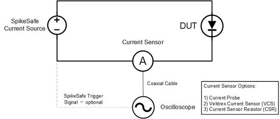
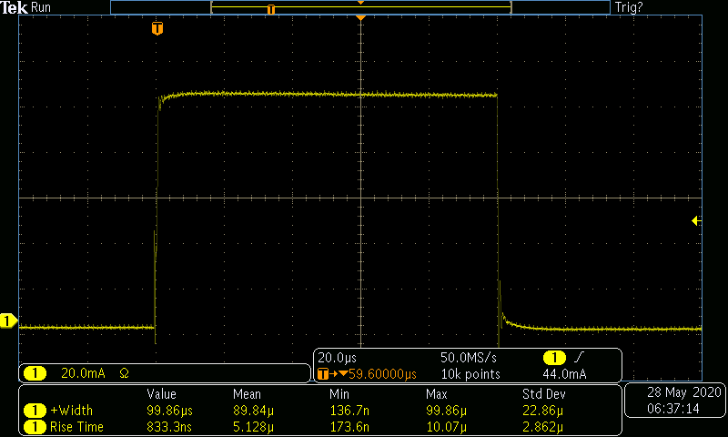

# Example for Determining Ideal Pulse Shape by Tuning Compensation Settings

## Purpose
Demonstrate how to achieve ideal current pulse shape in any scenario by systematically modifying SpikeSafe compensation settings. 

## Overview 
Current pulse shape is affected by a variety of factors including cable material and length, electrical connectors and interfaces, system noise, and DUT inductance. Due to this variability, the SpikeSafe has settable compensation settings to achieve an ideal pulse shape regardless of the test environment. By modifying the Rise Time and Load Impedance settings, the possible current pulse outputs can be explored to determine the ideal shape for a given test scenario.

Current pulse shape should be measured using an oscilloscope in conjunction with a [Current Sensor](https://www.vektrex.com/products/current-sensors/) or Current Probe. A digital multi-meter in conjunction with a current shunt resistor is also sufficient. Refer to the circuit diagram below.

**Pulse Tuning Circuit Diagram**

## Key Settings
- **Pulse Mode:** Single Pulse
- **Set Current:** 100mA
- **Compliance Voltage:** 20V
- **On Time:** 100µs
- **Ramp Rate:** Fast. Voltage will ramp as fast as 1000V/sec. Current will ramp as fast as 50A/sec. Fast ramp is almost always recommended to make the current pulse appear sooner. There may be cases where Fast ramp results in a small current through the load capacitance at startup due to the high dV/dt, in these cases Slow ramp is useful for devices that require a gentler turn-on.
- **Rise Time:** Very Slow, Slow, Medium, and Fast. This is one of two primary factors that affects pulse shape.
- **Load Impedance:** Very Low, Low, Medium, and High. This is the other primary factor that affects pulse shape.

In this test, an On Time of 100µs is used. It is recommended to modify this as your testing requires. Refer to the table below to determine which settings will most likely require testing for an ideal pulse shape.

## Considerations
- This sequence assumes the user has basic knowledge of SpikeSafe Single Pulse Mode operation. To find more information on the basics of SpikeSafe Single Pulse current output, see [Run Single Pulse](../../run_spikesafe_operating_modes/run_single_pulse).
- This sequence is intended to provide a framework for determining the ideal pulse shape. It cycles through all possible combinations of Rise Time and Load Impedance. Once patterns in a given test environment have been identified, it may be helpful to comment out redundant or ineffective compensation settings combinations from this sequence.

## Expected Results
Every combination of Rise Time/Load Impedance settings will be tested, resulting in 16 separate pulses. Pulses will all vary in shape to some extent. In between sessions, a message box will appear that pauses operation so that the user is able to observe the outputted pulse.

An ideal current pulse is generally one with a fast, vertical rising edge and minimal overshoot. Refer to the examples below:

**Unideal Pulse - Slow Rise Time**

**Unideal Pulse - Excessive Overshoot**

**Ideal Pulse**

