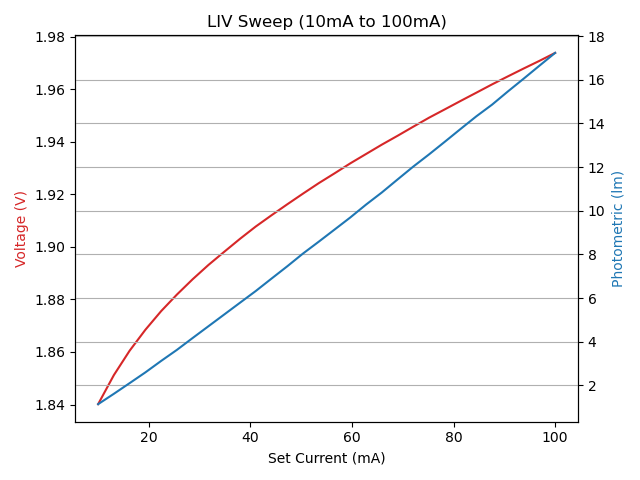

# Example for performing LIV Sweeps Using the SpikeSafe PSMU and a Spectrometer

In this sequence, we will address how to integrate a SpikeSafe PSMU into a light measurement system. From there, we will demonstrate how to easily perform LIV Sweeps using the SpikeSafe's Pulsed Sweep operation mode in conjunction with its integrated Voltage Digitizer. 

## **Purpose**
Demonstrate how to integrate the SpikeSafe PSMU into a light measurement system and how to implement Pulsed Sweep current operation to obtain an LIV sweep measurement. An LIV sweep is a series of light, current, and voltage (i.e. L, I, and V) measurements across the operating spectrum of an LED or laser. It is a fundamental measurement in determining the operating characteristics of an LED or laser. LIV sweeps are generally graphed as shown below:

## Overview 
Operates SpikeSafe as an PSMU that outputs a pulsed current sweep and takes a series of voltage measurements throughout the current sweep. An Instrument Systems CAS4 spectrometer is implemented, which will take triggered light measurements. See the test diagram below:

The SpikeSafe PSMU operates similarly to the [Measure Pulsed Sweep Voltage](../../making_integrated_voltage_measurements/measure_pulsed_sweep_voltage) sequence. 

The CAS4 spectrometer is operated using external resources provided by Instrument Systems. To obtain the necessary resources to run this sequence, please visit [the Instrument Systems website](https://www.instrumentsystems.com/en/products/software/sdk-spectrometer/). After installing these resources on your computer, install the libraries listed in the **Considerations** section of this document. More information on CAS spectrometers can be found [here](https://www.instrumentsystems.com/en/products/spectrometers/).

## Key Settings 
The following settings are configured by default. At the top of the sequence, there are multiple lines corresponding to individual test parameters. These lines may be modified to match the necessary parameters for your specific LED or Laser.

### SpikeSafe Current Output Settings
- **Start Current:** 20mA
- **Stop Current:** 200mA
- **Step Count:** 19
- **Compliance Voltage:** 20V
- **On Time:** 20ms
- **Off Time:** 50ms

### Digitizer Voltage Measurement Settings
- **Voltage Range:** 100V
- **Aperture:** 12ms
- **Trigger Delay:** 4ms
- **Trigger Source:** Hardware
- **Trigger Edge:** Rising
- **Trigger Count:** 19 
- **Reading Count:** 1 (per trigger)

### CAS Spectrometer Light Measurement Settings
- **Autoranging:** Off
- **Integration Time:** 10ms
- **Trigger Mode:** Hardware (i.e. Flip-Flop)
- **Trigger Delay:** 5ms

## Considerations
- This sequence involves graphing measurement results, and requires the [matplotlib](https://matplotlib.org/) library. See instructions on installing this library under the "Usage" section in the [SpikeSafePythonSamples markdown file](/README.md#installing-matplotlib-package).
- This sequence employs external C resources, and requires the [PyCLibrary](https://pyclibrary.readthedocs.io/en/latest/) library. See instructions on installing this library under the "Usage" section in the [SpikeSafePythonSamples markdown file](/README.md#installing-pyclibrary-package).
- External resources are needed to operate the CAS4 spectrometer. These can be obtained by Instrument Systems, and should install the following files:
    - C headers file: C:\Program Files\Instrument Systems\CAS4x64-SDK\VC2013\CAS4.h
    - CAS DLL: C:\Windows\System32\CAS4x64.dll
- The CAS4 spectrometer requires a configuration (.INI) file and calibration (.ISC) file to operate. Both of these files should be copied and pasted to the SpikeSafePythonSamples\application_specific_examples\running_liv_sweeps folder before starting this sequence.
- In LIVSweepExample.py, modify the line `CAS4_interface_mode = 3` in order to specify the communication interface for the CAS4. The following communication interfaces are supported:
    - **1:** PCI
    - **3:** Demo (No hardware (Default))
    - **5:** USB
    - **10:** PCIe
    - **11:** Ethernet

## Expected Results
Upon starting the sequence, the user will be prompted to enter the names of the Instrument Systems configuration (.INI) file and calibration (.ISC) file that correspond to the test spectrometer. After initializing the spectrometer with the specified files, a Pulsed Sweep will be outputted and light measurements will be automatically taken. Upon completion of the sequence, a graph of the LIV sweep will appear onscreen. This graph will have a Voltage vs. Current plot overlaid with a Luminous Flux vs. Current plot generated using matplotlib. See the example below.

The results above were obtained using a SpikeSafe PSMU 5A in conjunction with a CAS 140D array spectroradiometer. The DUT was a standard orange LED with a forward current of 100mA. The Start Current and Stop Current were adjusted to 10mA and 100mA respectively to reflect DUT parameters.

