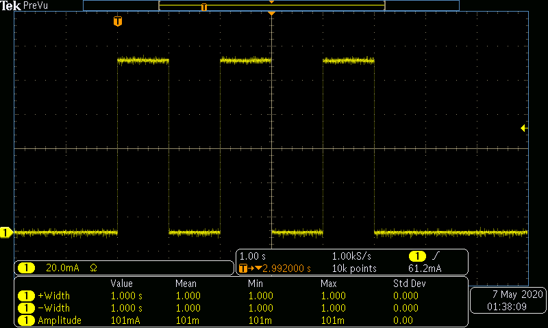
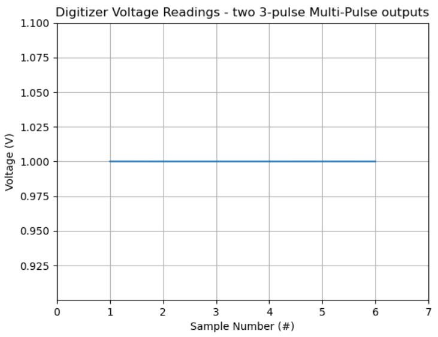

# Example for Using the Software-Controlled Digitizer Output Trigger

## Purpose
Demonstrate how to use the SpikeSafe PSMU's integrated Digitizer to output a trigger signal as an input to either the SpikeSafe current source or another instrument within a test system.

## Overview 
The SpikeSafe's integrated Digitizer has a Send External Instrument Trigger Out signal that is controlled through SCPI. If the Digitizer Trigger Source is set to Hardware, this signal can be used to trigger either the SpikeSafe or an external instrument. The SpikeSafe PRF and PSMU both have an Input Trigger that can be configured to start certain modes' output in response to a hardware trigger, either from the Digitizer or an external instrument.

For the SpikeSafe to utilize the Digitizer's Send External Instrument Trigger Out signal as an input, Vektrex's PSMU Trigger Cable needs to be implemented and the SpikeSafe needs to be operating in Multi Pulse, Pulsed Sweep, or Bias Pulsed Sweep mode. Using this trigger model, the SpikeSafe current output can be synchronized with external instruments such as a spectrometer. This is performed by setting the SpikeSafe Internal Trigger Polarity to External. Once this is configured, the Digitizer will output a External Instrument Trigger Out signal whenever the SpikeSafe receives the `VOLT:OUTP:TRIG` command.

This sequence operates SpikeSafe as both a pulsed current source and a high precision voltage measurement device. The SpikeSafe and Digitizer will be configured so that the Digitizer External Instrument Trigger Out signal will start SpikeSafe current output. When current pulses are outputted, voltage measurements will be taken across the flattest portion of each current pulse. Voltage readings of two separate Multi Pulse sequences will be graphed onscreen.

## Key Settings

### SpikeSafe Current Output Settings
- **Pulse Mode:** Multi Pulse
- **Set Current:** 100mA
- **Compliance Voltage:** 20V
- **Pulse Count:** 3
- **On Time:** 1s
- **Off Time:** 1s
- **Input Trigger Source:** External (necessary to respond to Digitizer External Instrument Trigger Out signal)
- **Input Trigger Delay:** 10µs (min)
- **Input Trigger Polarity:** Rising

### Digitizer Voltage Measurement Settings
- **Hardware Trigger Edge:** Rising. For best results, the SpikeSafe Input Trigger Polarity should match this setting.
- **Voltage Range:** 10V
- **Aperture:** 400ms (max)
- **Trigger Delay:** 200ms
- **Trigger Source:** Hardware
- **Trigger Edge:** Rising
- **Trigger Count:** 6 (will measure two Multi Pulse sequences) 
- **Reading Count:** 1 (per trigger)

## Considerations
This sequence assumes the user has basic knowledge of SpikeSafe Multi Pulse operation and SpikeSafe PSMU Digitizer measurement. To find more information on the basics of SpikeSafe Multi Pulse current output, see [Run Multi Pulse](../../run_spikesafe_operating_modes/run_multi_pulse). To find more information on SpikeSafe PSMU Digitizer operation, see [Making Integrated Voltage Measurements](../../making_integrated_voltage_measurements)

## Expected Results
The SpikeSafe current output will look exactly as it does in the "Run Multi Pulse" example. However, this output will be dependent upon the Digitizer External Instrument Trigger Out signal rather than the `OUTP<n>:TRIG` command. Two Multi-Pulse sequences will be outputted in total. See the screenshot below, which was acquired by measuring output current using a TCPA300 Current Probe into a MDO3024 Mixed Domain Oscilloscope:

In SpikeSafePythonSamples release 1.2.0, this screenshot will be updated to include the Digitizer hardware output trigger that precedes the first SpikeSafe current output by 10µs. To test this signal yourself, route pin 12 of the SpikeSafe Digital I/O to your oscilloscope. The signal will be a 5V active-high pulse with width of 100 ± 5µs.

In addition to the current output, the Digitizer will make a voltage measurement per pulse. Since two sequences of three pulses are measured, six voltage measurements should be made that are roughly equivalent. See the graph below, which shows the voltage measurements across a 10Ω resistor:

