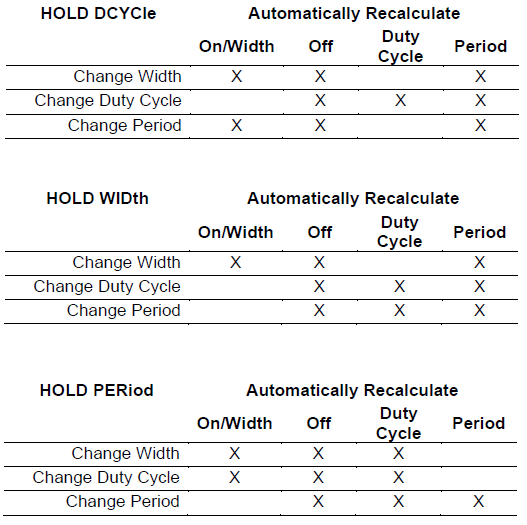

# Example for Modifying Pulse On Time and Off Time using Alternate API

## Purpose
Demonstrate how to modify the SpikeSafe's Pulse On Time and Off Time using the commands to set Pulse Width, Duty Cycle, Pulse Period, and Pulse Hold. 

## Overview 
The On Time and Off Time values can be modified using their own commands, which is demonstrated throughout the other sequences in this repository. These values can also be updated with an alternate command set in which the user configures the Pulse Width, Duty Cycle, and Pulse Period.

The Pulse Width, Duty Cycle, and Pulse Period settings are defined below. Since these three settings are all related to one another, changing one of these settings will result in an automatic re-calculation of another setting within the group. In order to account for this re-calculation, the Pulse Hold setting is available to specify which value will retain its previous value (i.e. "be held").

## Definitions
- **On Time:** The time per Pulse Period that the output current is equal to the Set Current
- **Off Time:** The time per Pulse Period that the output current is equal to 0A
- **Pulse Width:** Synonymous with On Time
- **Duty Cycle:** The percentage of a Pulse Period that the output current is equal to the Set Current
- **Pulse Period:** The sum of the On Time and Off Time when outputting pulsed current

## Key Settings
- **Pulse Mode:** Continuous Dyanmic
- **Set Current:** 100mA
- **Compliance Voltage:** 20V
- **On Time and Off Time:** Varies due to modification of Pulse Width, Duty Cycle and Pulse Period

In this example, the Pulse Width, Duty Cycle, Period, and Pulse Hold will be modified dynamically while the channel is enabled. When a given setting is specified, the related settings will be modified as follows:

## Considerations
- This sequence assumes the user has basic knowledge of SpikeSafe Pulsed Dynamic Mode operation. To find more information on the basics of SpikeSafe Pulsed Dynamic current output, see [Run Pulsed Dynamic Mode](../../run_spikesafe_operating_modes/run_pulsed/README.md#run%20pulsed%20dynamic%20mode).
- The command set demonstrated throughout this sequence was designed to be sent to the SpikeSafe one command at a time. If multiple pulse settings are sent simultaneously, there will be a span of a few microseconds per setting where pulse behavior is updating to match the specified setting.
- Although it is possible to use the Pulse Width, Duty Cycle, Pulse Period, and Pulse Hold commands in conjunction with the On Time and Off Time commands, it is not recommended to do so. The alternate command set demonstrated in this sequence is designed for quick, on-the-fly changes which result in a recalculation of related settings. On and Off Time commands circumvent this recalculation.
- Since using this command set results in recalculation of settings, it is recommended to re-query Pulse Width, Duty Cycle, and Pulse Period any time one of the three settings is configured.

## Expected Results
The On Time and Off Time will be dynamically modified while the channel is running. The actions taken within the sequence will be logged in the SpikeSafePythonSamples.log file as well as the terminal. This output should match the text below:

>Held Pulse Period

>Set Pulse Width to 0.008s

>Updated Pulse Width: 0.008000s

>Updated Duty Cycle: 80.00001%

>Updated Pulse Period: 0.010000s

>Set Duty Cycle to 50%

>Updated Pulse Width: 0.005000s

>Updated Duty Cycle: 50.00000%

>Updated Pulse Period: 0.010000s

>Set Duty Cycle to 0%

>Updated Pulse Width: 0.000000s

>Updated Duty Cycle: 0.000000%

>Updated Pulse Period: 0.010000s

>Set Duty Cycle to 100%

>Updated Pulse Width: 0.010000s

>Updated Duty Cycle: 100.0000%

>Updated Pulse Period: 0.010000s

>Held Pulse Width

>Set Pulse Period to 0.02s

>Updated Pulse Width: 0.010000s

>Updated Duty Cycle: 50.00000%

>Updated Pulse Period: 0.020000s

>Set Duty Cycle to 25%

>Updated Pulse Width: 0.010000s

>Updated Duty Cycle: 25.00000%

>Updated Pulse Period: 0.040000s

>Held Duty Cycle

>Set Pulse Period to 0.2s

>Updated Pulse Width: 0.050000s

>Updated Duty Cycle: 25.00000%

>Updated Pulse Period: 0.200000s

>Set Pulse Width to 0.001s

>Updated Pulse Width: 0.001000s

>Updated Duty Cycle: 25.00000%

>Updated Pulse Period: 0.004000s

Most of these settings adjustments occur on a 2-second interval and can be observed using an oscilloscope or digital multi-meter.