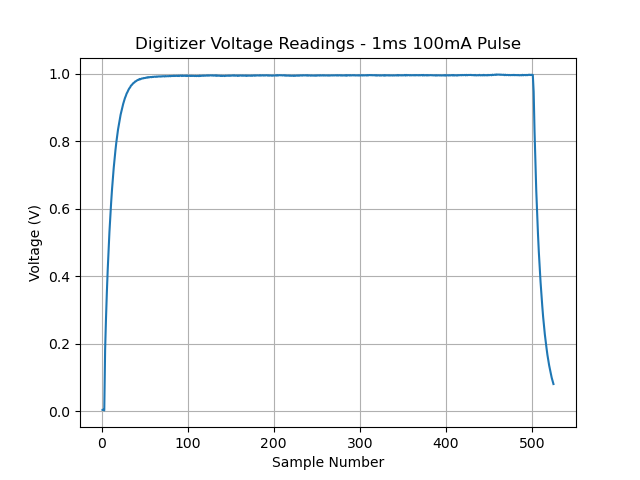

# Example for Obtaining Voltage Measurements Across a Single Pulse Using the SpikeSafe SMU Digitizer

## Purpose
Demonstrate how to use the SpikeSafe SMU's integrated Digitizer to make high precision voltage measurements to determine the pulse shape of a single current pulse supplied to an LED, Laser, or electrical component. In this example, the Digitizer is taking continuous small-aperture readings across a single pulse outputted from the SpikeSafe.

## Overview 
Operates SpikeSafe as both a pulsed current source and a high precision voltage measurement device. When the SpikeSafe outputs a current pulse, the Digitizer uses the rising edge of that pulse as a trigger to take a series of quick, sequential measurements. This happens until both the pulse is complete and the reading buffer of the SpikeSafe SMU Digitizer is full.  Voltage readings are then read and plotted.

Note the use of the New Data query while the SpikeSafe is operating. While the Digitizer is still acquiring voltage data, it can be unobtrusively queried to determine if the buffer is full yet. This information can be used to determine whether the user would ideally want to fetch data, as the data fetch will only return fresh data if the specified measurements have occurred.

## Key Settings

### SpikeSafe Current Output Settings
- **Pulse Mode:** Single Pulse
- **Set Current:** 100mA
- **Compliance Voltage:** 20V
- **On Time:** 1ms
- **Ramp Rate:** Fast. Voltage will ramp as fast as 1000V/sec. Current will ramp as fast as 50A/sec.

### Digitizer Voltage Measurement Settings
- **Voltage Range:** 10V
- **Aperture:** 2µs (min)
- **Trigger Delay:** 0µs
- **Trigger Source:** Hardware
- **Trigger Edge:** Rising
- **Trigger Count:** 1
- **Reading Count:** 525 (max)

## Considerations
- This sequence assumes the user has basic knowledge of SpikeSafe Single Pulse Mode operation. To find more information on the basics of SpikeSafe single pulse current output, see [Run Single Pulse](../run_single_pulse).
- To apply this principle to measure voltages across a pulse of different width, one should note the following parameter constraints:
    - Aperture must be set in increments of 2µs, with 2µs being the minimum value
    - The Digitizer is able to store a maximum of 525 readings
    - It is often useful to observe the falling edge of a pulse. To perform this, optimize test parameters so that Pulse Width = 500 * Aperture. Set Reading Count to 525.

## Expected Results
The SpikeSafe current output will look exactly as it does in the "Run Single Pulse" example. The Digitizer voltage measurements will be returned as a string in byte format with comma-separated voltage measurements in scientific notation. In this example, a graph of the measured pulse will automatically be generated. See an example of pulse output into a 10Ω resistor shown below:

