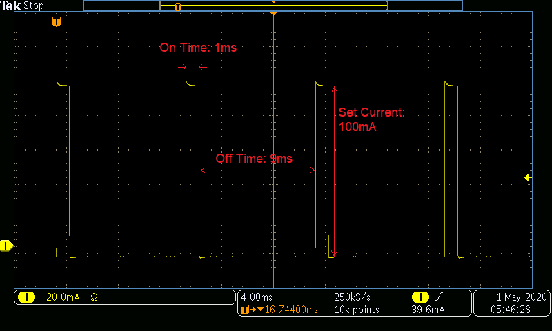

# Examples for Operating a SpikeSafe PRF or SMU in Pulsed modes

## **Purpose**
How to use a SpikeSafe PRF or SMU to deliver high precision pulsed current to an LED or Laser. These operation modes output a continuous current pulse train at the specified Set Current, On Time, and Off Time. The two modes differ in the way they start up, and the way they regulate current after startup.

Vektrex recommends using Continuous Dynamic for testing low currents below a few amps.  Continuous Dynamic starts with no ramp, the current transitions from zero to the programmed value in microseconds. Continuous Dynamic does not make adjustement to decrease internal power disipation.

For long term testing over a few amps Continuous mode is recommend. Continuous Mode makes internal adjustment to decrease power dissipation. For long term reliability testing the reduction is power can same energy and generate less heat. The small adjustments can introduce a very small current variation, usually less than 0.1% of programmed setpoint.

## **Run Pulsed Mode**

### Overview 
Operates SpikeSafe as pulsed current source with single output current and user-specified Pulse On Time and Pulse Off Time.

On Time and Off Time can be set using an alternative command set that consists of setting Duty Cycle, Period, and/or Pulse Width. A tutorial describing use of these alternative commands can be found in the [Using Pulse Holds](../application_specific_examples/using_pulse_holds) folder.

### Key Settings 
- **Set Current:** 100mA
- **Compliance Voltage:** 20V
- **On Time:** 1ms
- **Off Time:** 9ms
- **Ramp Rate:** Default. Voltage will ramp as fast as 10V/sec. Current will ramp as fast as 1A/sec.

### Current Output
- When running either sequence, one can expect to see the following current output and pulse shape. This image was acquired by measuring output current using a TCPA300 Current Probe into a MDO3024 Mixed Domain Oscilloscope

**Pulse Shape**

**Continuous Pulse Train**

## **Run Pulsed Dynamic Mode**

### Overview
Operates SpikeSafe as pulsed current source with multiple output currents. In Continuous Dynamic mode, the Set Current, On Time, and Off Time can be modified while the SpikeSafe is outputting current.  

Set the Maximum Compliance Voltage (MCV) to the expected load voltage +5V. Reduce MCV if an internal over power error occurs. 

### Key Settings
- **Set Current:** 100mA initially. While the channel is operating, the Set Current will be dynamically changed to 200mA.
- **On Time:** 1ms initially. While the channel is operating, the On Time will be dynamically changed to 100µs.
- **Off Time:** 9ms initially. While the channel is operating, the Off Time will be dynamically changed to 100µs.
- **Compliance Voltage:** 20V
- **Ramp Rate:** Default. Voltage will ramp as fast as 10V/sec. Current will ramp as fast as 1A/sec.

### Current Output
- In addition to seeing the current ramp in the figure above, one can expect to see the following current modifications when running this Pulsed Dynamic sequence. This image was acquired by measuring output current using a TCPA300 Current Probe into a MDO3024 Mixed Domain Oscilloscope

