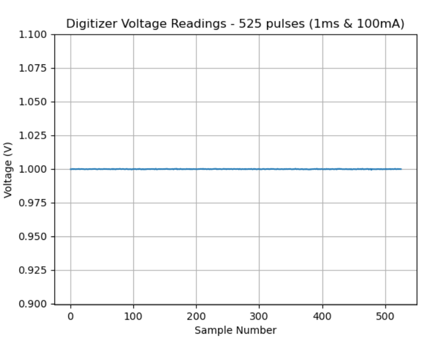

# Example for Obtaining Voltage Measurements Using the SpikeSafe SMU Digitizer in a Pulsed Mode

## Purpose
Demonstrate how to use the SpikeSafe SMU's integrated Digitizer to make high precision voltage measurements while supplying pulsed current to an LED, Laser, or electrical component. In this example, the Digitizer is taking triggered readings on the rising edge of the SpikeSafe's pulsed current output.

## Overview 
Operates SpikeSafe as both a pulsed current source and a high precision voltage measurement device. While current pulses are outputted, voltage measurements are being taken across the flattest portion of each current pulse. This happens until the reading buffer of the SpikeSafe SMU Digitizer is full, in which all voltage readings are read and printed to the console.

The digitizer is set to receive a hardware trigger, meaning that it will use the SpikeSafe's output trigger signal as its input trigger. The measurement is delayed slightly to avoid measuring any rise time or possible current overshoot on the DUT.

Note the use of the New Data query while the SpikeSafe is operating. While the Digitizer is still acquiring voltage data, it can be unobtrusively queried to determine if the buffer is full yet. This information can be used to determine whether the user would ideally want to fetch data, as the data fetch will only return fresh data if the specified measurements have occurred.

## Key Settings

### SpikeSafe Current Output Settings
- **Pulse Mode:** Continuous Pulse
- **Set Current:** 100mA
- **Compliance Voltage:** 20V
- **On Time:** 1ms
- **Off Time:** 9ms
- **Ramp Rate:** Fast. Voltage will ramp as fast as 1000V/sec. Current will ramp as fast as 50A/sec.

### Digitizer Voltage Measurement Settings
- **Voltage Range:** 10V
- **Aperture:** 600µs
- **Trigger Delay:** 200µs
- **Trigger Source:** Hardware
- **Trigger Edge:** Rising
- **Trigger Count:** 525 (max)
- **Reading Count:** 1 (per trigger)

## Considerations
This sequence assumes the user has basic knowledge of SpikeSafe Pulsed Mode operation. To find more information on the basics of SpikeSafe pulsed current output, see [Run Pulsed Mode](../../run_spikesafe_operating_modes/run_pulsed).

## Expected Results
The SpikeSafe current output will look exactly as it does in the "Run Pulsed" example. The Digitizer voltage measurements will be returned as a string in byte format with comma-separated voltage measurements in scientific notation. See the format of the fetch response below, in which a DUT with a forward voltage of 1V was measured:

`b'9.9962598e-01,1.0007857e+00,9.9950254e-01,[...],9.9971998e-01\n'`

A full fetch response string resulting from this sequence can be observed in [expected_fetch_response.txt](expected_fetch_response.txt).

When running the sequence, the 525 readings will be displayed in a graphical format, similar to the graph below.

