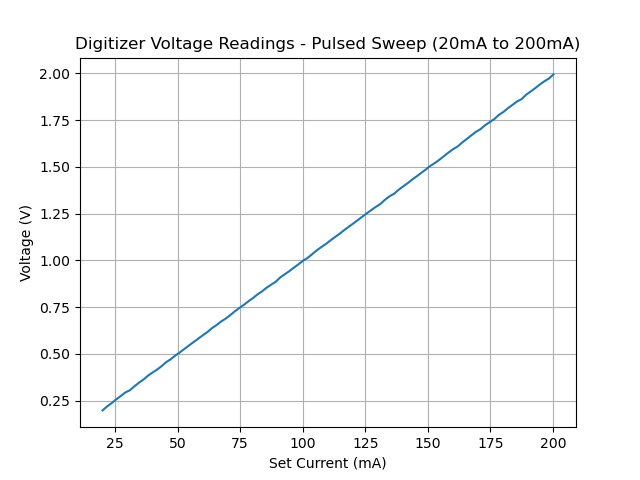
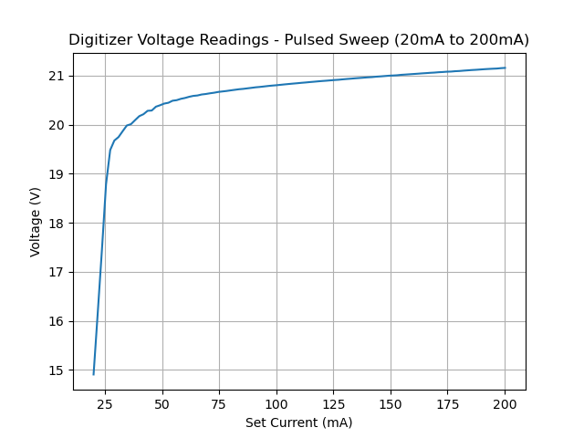

# Example for Obtaining Voltage Measurements to Graph an I-V Curve Using the SpikeSafe SMU Digitizer in Pulsed Sweep Mode

## Purpose
Demonstrate how to obtain the I-V curve of a given LED, Laser, or electrical component using the SpikeSafe SMU. Determining the actual I-V curve of a given DUT helps validate the part by comparing the measured results to the expected results provided within the part's documentation.

The SpikeSafe SMU's integrated Digitizer is used to make high precision voltage measurements while outputting a pulsed current sweep to the DUT. The Digitizer is taking triggered readings on the rising edge of the SpikeSafe's pulsed current output.

## Overview 
Operates SpikeSafe as both a pulsed current source and a high precision voltage measurement device. A Pulsed Sweep is outputted as demonstrated in [Run Pulsed Mode](../../run_spikesafe_operating_modes/run_pulsed_sweep). While current pulses are outputted, voltage measurements are being taken across the flattest portion of each current pulse. After all measurements are taken and read, the results are plotted in an I-V graph.

The Digitizer is set to receive a hardware trigger, meaning that it will use the SpikeSafe's output trigger signal as its input trigger. The measurement is delayed slightly to avoid measuring any rise time or possible current overshoot on the DUT.

Note the use of the New Data query while the SpikeSafe is operating. While the Digitizer is still acquiring voltage data, it can be unobtrusively queried to determine if the buffer is full yet. This information can be used to determine whether the user would ideally want to fetch data, as the data fetch will only return fresh data if the specified measurements have occurred.

## Key Settings

### SpikeSafe Current Output Settings
- **Start Current:** 20mA
- **Stop Current:** 200mA
- **Step Count:** 100
- **Compliance Voltage:** 20V
- **On Time:** 100µs
- **Off Time:** 9.9ms

### Digitizer Voltage Measurement Settings
- **Voltage Range:** 10V
- **Aperture:** 60µs
- **Trigger Delay:** 20µs
- **Trigger Source:** Hardware
- **Trigger Edge:** Rising
- **Trigger Count:** 100
- **Reading Count:** 1 (per trigger)

## Considerations
This sequence assumes the user has basic knowledge of SpikeSafe Pulsed Sweep operation. To find more information on the basics of SpikeSafe pulsed current output, see [Run Pulsed Sweep](../../run_spikesafe_operating_modes/run_pulsed_sweep).

## Expected Results
The SpikeSafe current output will look exactly as it does in the "Run Pulsed Sweep" example. The Digitizer voltage measurements will be returned as a string in byte format with comma-separated voltage measurements in scientific notation. See the graphs below, which show an I-V curve using the above settings outputting to a 10Ω resistor, and to a 3.5A, 25V LED. 

**10Ω Resistor Sweep**

**LED Sweep**

NOTE: for the LED sweep, the following settings needed to be modified to accomodate the DUT:
- **Compliance Voltage:** 30V
- **Digtizer Voltage Range:** 100V
