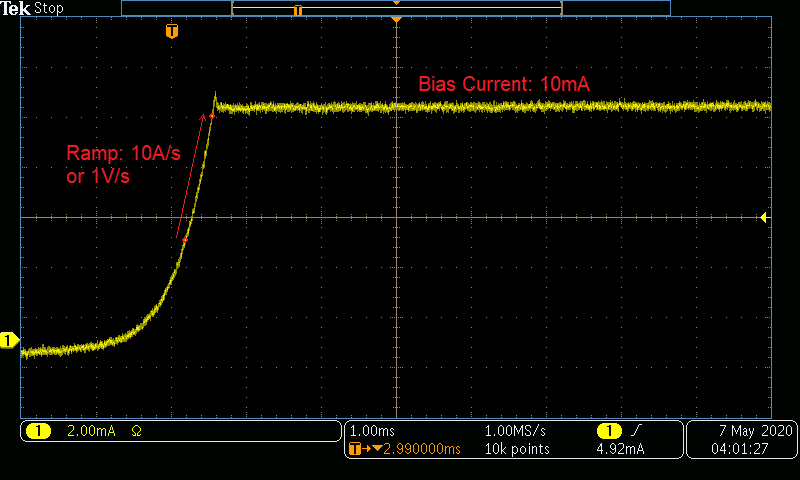

# Examples for Operating a SpikeSafe PRF or SMU in Bias mode

## **Purpose**
Demonstrate how to use a SpikeSafe PRF or SMU to deliver a low-amperage DC current to an LED or Laser.  This operation mode outputs constant current at the specified Bias Current between 0mA and 33mA. 

## **Run Bias Mode**

### Overview 
Operates SpikeSafe as low-amperage bias current source with single output current.

### Key Settings 
- **Bias Current:** 10mA
- **Compliance Voltage:** 10V
- **Ramp Rate:** Default. Voltage will ramp as fast as 10V/sec. Current will ramp as fast as 1A/sec.

### Current Output
- When running, one can expect to see the following current ramp and output. This image was acquired by measuring output current using a TCPA300 Current Probe into a MDO3024 Mixed Domain Oscilloscope

