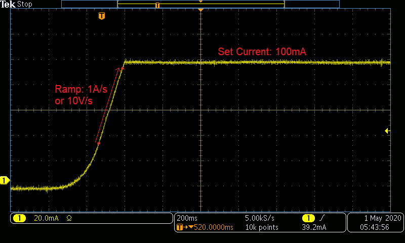
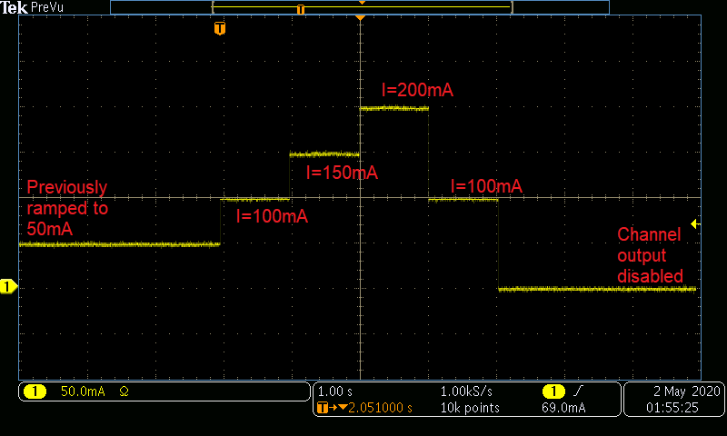

# Examples for Operating a SpikeSafe PRF or SMU in DC modes

## **Purpose**
Demonstrate how to use a SpikeSafe PRF or SMU to deliver high precision DC current to an LED or Laser.  DC and DC Dynamic operation modes output constant current at the specified Set Current. These two modes differ in the way they start up, and the way they regulate current after startup.

Vektrex recommends using DC Dynamic for testing low currents below a few amps.  DC Dynamic starts with no ramp; the current transitions from zero to the programmed value in microseconds. DC Dynamic does not make adjustment to decrease internal power dissipation.

For long term testing over a few amps DC mode is recommended.  DC Mode makes internal adjustment to decrease power dissipation.  For long term reliability testing this reduction in power will save energy and generate less heat.  The small adjustments can introduce a very small current variation, usually less than 0.1% of programmed set current.

## **Run DC Mode**

### Overview 
Operates SpikeSafe as a DC current source with single output current.

### Key Settings 
- **Set Current:** 100mA
- **Compliance Voltage:** 20V
- **Ramp Rate:** Default. Voltage will ramp as fast as 10V/sec. Current will ramp as fast as 1A/sec.

### Current Output
- When running either sequence, one can expect to see the following current ramp. This image was acquired by measuring output current using a TCPA300 Current Probe into a MDO3024 Mixed Domain Oscilloscope

## **Run DC Dynamic Mode**

### Overview
Operates SpikeSafe as a DC current source with multiple output currents. In DC Dynamic mode, the Set Current can be modified while the SpikeSafe is outputting current.  This example can be used to generate a software controlled stair case ramp.

Set the Maximum Compliance Voltage (MCV) to the expected load voltage +5V. Reduce MCV if an internal over power error occurs. 

### Key Settings
- **Set Current:** 50mA initially. While the channel is operating, the Set Current will be dynamically changed to 100mA, 150mA, 200mA, then back to 100mA.
- **Compliance Voltage:** 20V
- **Ramp Rate:** Default. Voltage will ramp as fast as 10V/sec. Current will ramp as fast as 1A/sec.

### Current Output
- In addition to seeing the current ramp in the figure above, one can expect to see the following current modifications when running this DC Dynamic sequence. This image was acquired by measuring output current using a TCPA300 Current Probe into a MDO3024 Mixed Domain Oscilloscope

