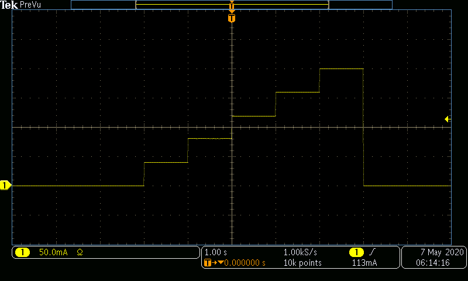
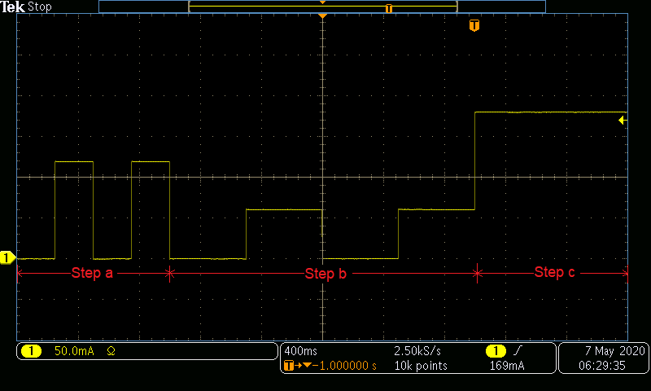

# Examples for Operating a SpikeSafe PRF or PSMU in Modulated DC modes

## **Purpose**
Demonstrate how to use a SpikeSafe PRF or PSMU to deliver a customizable high precision DC current output sequence to an LED or Laser.  This operation mode outputs DC power in steps as specified by a sequence command. A Set Current is specified similar to other modes, and then the modulated sequence is specified through a series of steps, each consisting of a percentage of the specified set current for a given amount of time in seconds.

Modulated DC mode can be thought of as a programmable version of DC Dynamic mode that requires a trigger command to output current.

## **Run Modulated DC Mode**

### Overview 
Operates SpikeSafe as a programmable DC current source with variable DC output current specified by a sequence command. Sequences can either last indefinitely, or for a specified amount of time. If the channel is enabled and the modulated sequence completes, the event queue will output the message "105, Modulated SEQ is completed".

Similar to Pulsed Sweep, Single Pulse, and Multi Pulse modes, Modulated DC mode requires a trigger command to be sent to output current. A trigger command will only be accepted if the channel is ready for a trigger, in which the SpikeSafe event queue will output a "100, Channel Ready" message.

Set the Maximum Compliance Voltage (MCV) to the expected load voltage +5V. Reduce MCV if an internal over power error occurs. 

### Key Settings 
- **Set Current:** 200mA
- **Compliance Voltage:** 20V
- **Ramp Rate:** Default. Voltage will ramp as fast as 10V/sec. Current will ramp as fast as 1A/sec.
- **Sequence:**
    - `1(1@20,1@40,1@60,1@80,1@100)`: This will perform a 5-step DC staircase. There will be 1-second steps of 40mA, 80mA, 120mA, 160mA, and 200mA.
    - `*(2(.25@0,.25@60),2(.5@0,.5@30),1@90)`: This will output a continuous pulsing pattern that will last as long as the channel is enabled. It will repeatedly output the following 3 steps:
        1. It will pulse Off for 250ms, then On for 250ms at 120mA. This will happen twice
        2. It will pulse Off for 500ms, then On for 500ms at 60mA. This will also happen twice 
        3. For one second, 180mA will be outputted

### Current Output
- When running the modulated sequences, the following outputs can be observed. This image was acquired by measuring output current using a TCPA300 Current Probe into a MDO3024 Mixed Domain Oscilloscope

**DC Staircase (1(1@20,1@40,1@60,1@80,1@100))**

**Infinite Pulsing Pattern (*(2(.25@0,.25@60),2(.5@0,.5@30),1@90)**

