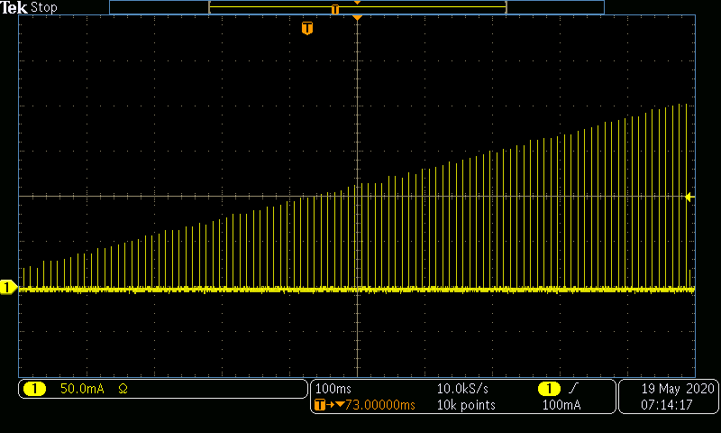
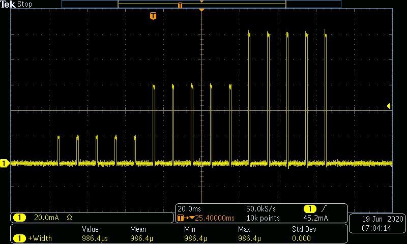

# Examples for Operating a SpikeSafe PRF or PSMU in Pulsed Sweep mode

## **Purpose**
Demonstrate how to use a SpikeSafe PRF or PSMU to deliver a pulsed current sweep to an LED or Laser. This operation mode ignores the typical Set Current setting, and instead specifies a Start Current and Stop Current. This mode is akin to a pulsed stair case output with user-specified Step Count, On Time, and Off Time. Stair case can be upward facing (Start Current < Stop Current) or downward facing (Start Current > Stop Current).

## **Run Pulsed Sweep Mode**

### Overview 
Operates SpikeSafe as a pulsed current source outputting a pulsed current sweep from a specified Start Current to a specified Stop Current. Intermediate current step amplitudes are calculated using the user-specified Step Count:

With default settings, a pulsed sweep is started when the "Output Trigger" SCPI command is received. A channel that is operating in Pulsed Sweep mode can output as many sweeps as specified while enabled. A new pulsed sweep will only be started if the initialization trigger is received after the previous pulsed sweep is complete. The event queue will output a new "109, Pulsed Sweep Complete" message once a pulsed sweep completes.

### Key Settings 
- **Start Current:** 20mA
- **Stop Current:** 200mA
- **Step Count:** 100
- **Pulse Count:** 1
- **Compliance Voltage:** 20V
- **On Time:** 100µs
- **Off Time:** 9.9ms

### Current Output
When running a pulsed sweep using this sequence, one can expect to see the following output. This image was acquired by measuring output current using a TCPA300 Current Probe into a MDO3024 Mixed Domain Oscilloscope

**Full Pulsed Sweep**

**Current Pulse Shape**

## **Run Bias Pulsed Sweep Mode**

### Overview
Operates SpikeSafe as a pulsed current source outputting a pulsed current sweep from a specified Start Current to a specified Stop Current. Pulses are outputted when the "Output Trigger" SCPI command is received. 

This mode is very similar to Pulsed Sweep mode, except that there is a user-specified constant Bias Current being outputted on the milliAmp scale while the channel is enabled. When a pulse is outputted, the current amplitude will be equivalent to the Step Current plus the Bias Current.

### Key Settings
- **Start Current:** 20mA
- **Stop Current:** 200mA
- **Bias Current:** 10mA
- **Step Count:** 100
- **Pulse Count:** 1
- **Compliance Voltage:** 20V
- **On Time:** 100µs
- **Off Time:** 9.9ms

### Current Output
When running this sequence, one can expect to see the following pulse output. Note the 10mA offset between the channel running Bias Pulsed Sweep (in yellow) and the channel running Pulsed Sweep without a Bias Current (in white). This image was acquired by measuring output current using a TCPA300 Current Probe into a MDO3024 Mixed Domain Oscilloscope

## Advanced Cases (applicable to both Pulsed Sweep modes)
For more advanced cases, a Pulse Count may be specified that sets the amount of pulses that are outputted per current step in the Pulsed Sweep. This is especially useful when outputting to Lasers that require [Quasi-Continuous Wave](https://www.rp-photonics.com/quasi_continuous_wave_operation.html) (QCW) operation. QCW operation entails switching on the pump source of a laser for time intervals that are short enough to reduce thermal effects significantly, but still long enough that the laser behaves similar to steady state operation (i.e. [continuous wave operation](https://www.rp-photonics.com/continuous_wave_operation.html)).

For most cases, the Pulse Count will be set to 1, but for advanced cases such as QCW this may be set greater than 1. In this sequence, Pulse Count is set in the line `tcp_socket.send_scpi_command('SOUR1:PULS:COUN 1')`. This command line may be modified to run a Pulsed Sweep with multiple pulses per current step. See the example below where a Pulsed Sweep is run with Pulse Count = 5 and Step Count = 3:

