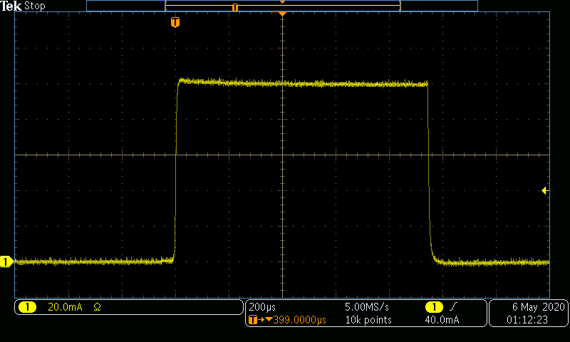
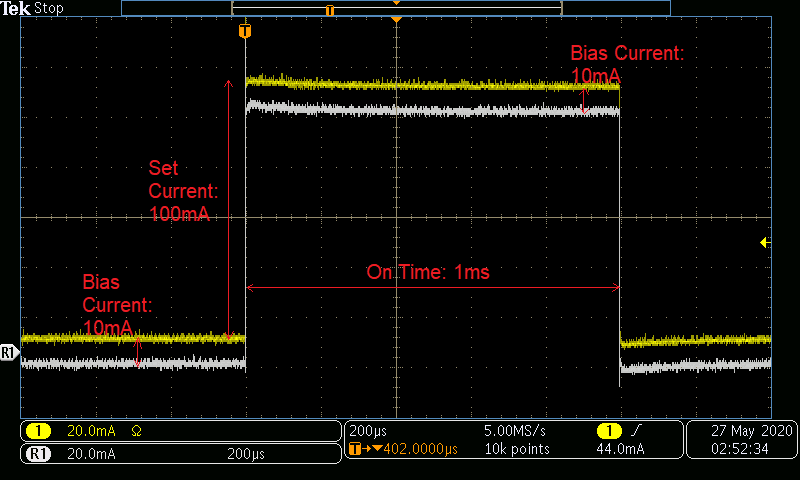

# Examples for Operating a SpikeSafe PRF or SMU in Single Pulse mode

## **Purpose**
Demonstrate how to use a SpikeSafe PRF or SMU to deliver a high precision single current pulse to an LED or Laser. This operation mode consists of a user-specified Set Current and On Time to produce one current pulse when a trigger command is sent to the SpikeSafe.

## **Run Single Pulse Mode**

### Overview 
Operates SpikeSafe as a pulsed current source outputting a single pulse with user-specified output current and Pulse On Time. Pulses are outputted when the "Output Trigger" SCPI command is received. 

A channel that is operating in Single Pulse mode can output as many pulses as specified while enabled. A pulse will only be outputted if the command is received after the previous pulse is complete. When a channel is enabled but no pulse is outputting, the user is able to change the Set Current.

### Key Settings 
- **Set Current:** 100mA initially. After pulses have been outputted, the Set Current is changed to 200mA while the channels are enabled.
- **Compliance Voltage:** 20V
- **On Time:** 1ms

### Current Output
When running this sequence, one can expect to see the following pulse output when running with a Set Current of 100mA. This image was acquired by measuring output current using a TCPA300 Current Probe into a MDO3024 Mixed Domain Oscilloscope

## **Run Bias Single Pulse Mode**

### Overview
Operates SpikeSafe as a pulsed current source outputting a single pulse with user-specified output current and Pulse On Time. Pulses are outputted when the "Output Trigger" SCPI command is received. 

This mode is very similar to Single Pulse mode, except that there is a user-specified constant Bias Current being outputted on the milliAmp scale while the channel is enabled. When a pulse is outputted, the current amplitude will be equivalent to the Set Current plus the Bias Current.

### Key Settings
- **Set Current:** 100mA
- **Bias Current:** 10mA
- **On Time:** 1ms
- **Compliance Voltage:** 20V

### Current Output
When running this sequence, one can expect to see the following pulse output. Note the 10mA offset between the channel running Bias Single Pulse (in yellow) and the channel running Single Pulse without a Bias Current (in white). This image was acquired by measuring output current using a TCPA300 Current Probe into a MDO3024 Mixed Domain Oscilloscope

