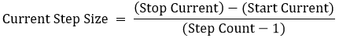
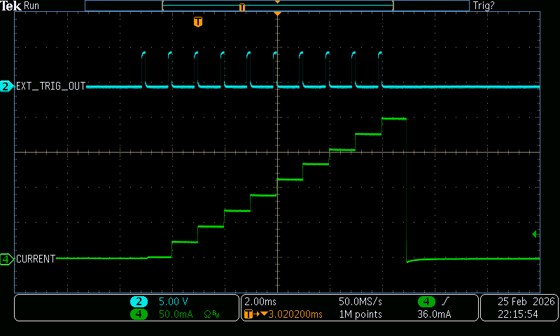

# Examples for Operating a SpikeSafe PRF or PSMU in Staircase Sweep mode

## **Purpose**
Demonstrate how to use a SpikeSafe PRF or PSMU to deliver a staircase sweep to an LED or Laser. This operation mode ignores the typical Set Current setting, and instead specifies a Start Current and Stop Current. This mode is akin to a DC stair case output with user-specified Step Count, On Time, and no Off Time. Stair case can be upward facing (Start Current < Stop Current) or downward facing (Start Current > Stop Current).

## **Run Staircase Sweep Mode**

### Overview 
Operates SpikeSafe as a DC current source outputting a staircase sweep from a specified Start Current to a specified Stop Current. Intermediate current step amplitudes are calculated using the user-specified Step Count:

With default settings, a staircase sweep is started when the "Output Trigger" SCPI command is received. A channel that is operating in Staircase Sweep mode can output as many sweeps as specified while enabled. A new staircase sweep will only be started if the initialization trigger is received after the previous staircase sweep is complete. The event queue will output a new "127, Staircase Sweep is completed" message once a pulsed sweep completes.

### Key Settings 
- **Start Current:** 20mA
- **Stop Current:** 200mA
- **Step Count:** 100
- **Pulse Count:** 1
- **Compliance Voltage:** 20V
- **On Time:** 1ms

### Current Output
When running a staircase sweep using this sequence, one can expect to see the following output. This image was acquired by measuring output current using a TCPA300 Current Probe into a MDO3024 Mixed Domain Oscilloscope

**Full Pulsed Sweep**

**Current Pulse Shape**

